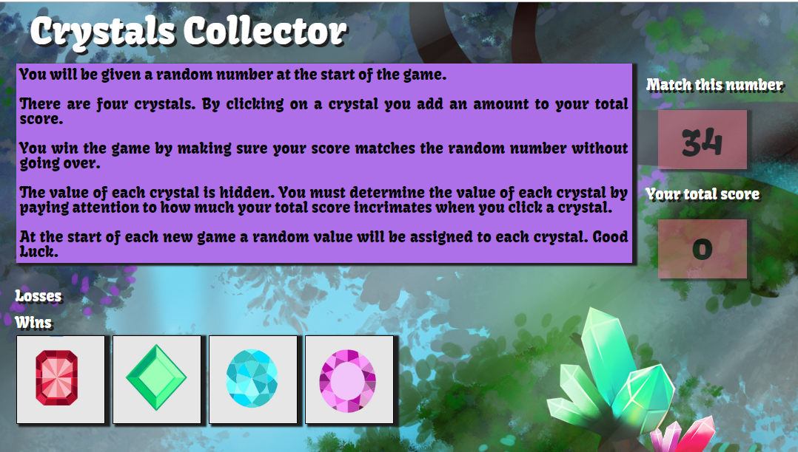

# Crystals Collector

## Simple One page Game

* There are four crystals displayed as buttons on the page.
* The player is shown a random number at the start of the game.

* When the player clicks on a crystal, it adds a specific amount of points to the player's total score. 

* Game hides this amount until the player clicks a crystal.
* When they do click one, player's score is updated.

   * The player wins if their total score matches the random number from the beginning of the game.
   * The player loses if their score goes above the random number.

* The game restarts whenever the player wins or loses.

* When the game begins again, the player sees a new random number. Also, all the crystals will have four new hidden values. Of course, the user's score (and score counter) will reset to zero.

* The app shows the number of games the player wins and loses.  

 ## Overview

In this assignment, I created a fun and interactive game for web browsers. This time, the app dynamically updates the users HTML pages with the jQuery library.

  

 [Link to application](https://cpaul319.github.io/Unit-4_Game/)

